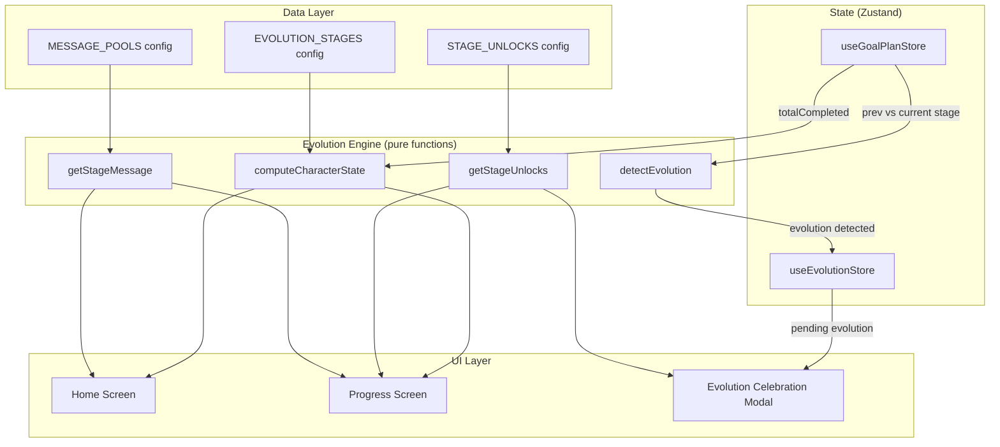

# Design Document: Evolution System Redesign

## Overview

This design transforms Momentum's character evolution system from a simple challenge-count-to-emoji mapping into a psychologically meaningful, identity-driven progression system. The core change is enriching the `CharacterStage` data model with identity labels, psychological descriptions, transformation narratives, stage-specific unlocks, motivational message pools, and an evolution celebration flow.

The architecture remains pure and deterministic — the Evolution Engine stays a side-effect-free module that computes state from challenge history. The UI layers (Progress Screen, Home Screen) consume the enriched data to deliver emotional, identity-based experiences.

Key design decisions:

- **Data-driven**: All stage identities, unlocks, and messages are defined as static configuration data, not computed at runtime. This keeps the engine pure and testable.
- **Backward compatible**: The existing `computeCharacterState` API is extended (not replaced) so existing consumers continue to work.
- **No new persistence**: Evolution state is still derived from challenge counts in Zustand stores. No new AsyncStorage keys needed.
- **Minimal new dependencies**: Uses existing `react-native-reanimated`, `expo-haptics`, and `react-native-confetti-cannon` for celebration UX.

## Architecture



The architecture adds three concerns to the existing system:

1. **Enriched stage data** — Static config arrays defining identities, unlocks, and message pools per stage.
2. **Evolution detection** — A thin Zustand store (`useEvolutionStore`) that tracks the last-seen stage index and flags pending evolutions for the celebration modal.
3. **Celebration UI** — A modal component triggered when an evolution is detected, showing the new identity, narrative, and unlocks.

## Components and Interfaces

### 1. Evolution Engine (`src/features/character/engine.ts`)

Extended with enriched stage data and new helper functions.

```typescript
export interface StageIdentity {
  name: string;
  emoji: string;
  minChallenges: number;
  identityLabel: string; // e.g., "The Beginner"
  description: string; // psychological description
  transformationNarrative: string; // e.g., "You decided to begin."
}

export interface StageUnlock {
  type:
    | "visual_variation"
    | "badge"
    | "ai_insight"
    | "reflection_prompt"
    | "feature_access"
    | "motivational_message"
    | "streak_protection"
    | "advanced_analytics";
  title: string;
  description: string;
  requiresPro?: boolean;
}

export interface EvolutionStage {
  identity: StageIdentity;
  unlocks: StageUnlock[];
  messages: string[]; // rotating motivational message pool
}

export interface CharacterState {
  stage: StageIdentity;
  stageIndex: number;
  totalCompleted: number;
  nextMilestone: number | null;
  progressToNext: number;
  unlocks: StageUnlock[];
  progressMessage: string; // identity-based progress message
}
```

New pure functions:

- `computeCharacterState(totalCompleted: number): CharacterState` — Extended to return enriched data.
- `getStageUnlocks(stageIndex: number): StageUnlock[]` — Returns unlocks for a given stage.
- `getNewUnlocks(fromStageIndex: number, toStageIndex: number): StageUnlock[]` — Returns unlocks gained in a transition.
- `getStageMessage(stageIndex: number): string` — Returns a random motivational message from the stage's pool.
- `getProgressMessage(totalCompleted: number): string` — Returns identity-based progress message (e.g., "4 more steps to becoming a Sapling").
- `getReturnMessage(stageIndex: number): string` — Returns a welcoming message for returning users.

### 2. Evolution Detection Store (`src/features/character/evolution-store.ts`)

A small Zustand store that tracks evolution transitions.

```typescript
interface EvolutionStoreState {
  lastSeenStageIndex: number;
  pendingEvolution: {
    fromStageIndex: number;
    toStageIndex: number;
  } | null;
  checkEvolution: (currentStageIndex: number) => void;
  dismissEvolution: () => void;
}
```

- `checkEvolution` is called after each challenge completion. If `currentStageIndex > lastSeenStageIndex`, it sets `pendingEvolution`.
- `dismissEvolution` clears the pending evolution and updates `lastSeenStageIndex`.
- Persisted to AsyncStorage via Zustand `persist` middleware (only `lastSeenStageIndex`).

### 3. Evolution Celebration Component (`src/components/EvolutionCelebration.tsx`)

A modal overlay triggered when `pendingEvolution` is non-null.

- Displays: new stage emoji (large, animated scale-in), identity label, transformation narrative, list of new unlocks.
- Uses `react-native-reanimated` for entrance animation (scale + fade).
- Triggers `expo-haptics` notification feedback.
- Fires confetti (distinct color palette from daily completion confetti).
- Dismiss button updates `useEvolutionStore.dismissEvolution()`.

### 4. Progress Screen Updates (`app/(main)/progress.tsx`)

- Character display section: Shows `identityLabel` and `description` from `StageIdentity`.
- Progress message: Replaces "N more to next evolution" with `getProgressMessage()` output.
- Evolution path: Each stage card shows `identityLabel`, `transformationNarrative`, and unlock previews.
- Reached stages show unlocked items; locked stages show previews with lock icons.
- Final stage (Ancient Grove) shows completion message instead of progress bar.

### 5. Home Screen Updates (`app/(main)/home.tsx`)

- Header: Shows `identityLabel` alongside emoji instead of just emoji + greeting.
- Daily challenge card: Includes a contextual `Identity_Message` from `getStageMessage()`.
- Return user detection: If the last completed challenge was >1 day ago, show `getReturnMessage()`.
- Challenge completion: After `completeCurrentChallenge`, call `checkEvolution()` to detect stage transitions.

## Data Models

### Evolution Stages Configuration

The seven stages with their full identity data:

| Stage         | Emoji | Min | Identity Label   | Description                                   | Transformation Narrative                                |
| ------------- | ----- | --- | ---------------- | --------------------------------------------- | ------------------------------------------------------- |
| Seed          | 🌰    | 0   | The Beginner     | Every journey starts with a single decision   | "You decided to begin."                                 |
| Sprout        | 🌱    | 3   | The Committed    | You're proving this isn't a passing thought   | "You're showing up."                                    |
| Sapling       | 🌿    | 7   | The Builder      | Consistency is becoming part of who you are   | "You're building something real."                       |
| Young Tree    | 🪴    | 15  | The Resilient    | Your roots run deep enough to weather storms  | "You've weathered doubt and kept going."                |
| Tree          | 🌳    | 30  | The Steady       | You don't need motivation — you have identity | "You became consistent."                                |
| Mighty Oak    | 🏔️    | 50  | The Unstoppable  | Your growth inspires the world around you     | "You didn't just change a habit. You changed yourself." |
| Ancient Grove | ✨    | 100 | The Transcendent | You are a force of nature                     | "You are proof that small steps create transformation." |

### Stage Unlocks Configuration

| Stage         | Unlock Type          | Title               | Description                                         | Pro? |
| ------------- | -------------------- | ------------------- | --------------------------------------------------- | ---- |
| Seed          | motivational_message | Daily Spark         | A motivational message with your daily challenge    | No   |
| Sprout        | badge                | First Steps Badge   | Earned by completing your first 3 challenges        | No   |
| Sprout        | reflection_prompt    | Growth Reflection   | A reflection prompt after each challenge            | No   |
| Sapling       | visual_variation     | Sapling Theme       | A fresh visual theme for your character display     | No   |
| Sapling       | ai_insight           | Weekly Insight      | AI-generated insight on your progress patterns      | Yes  |
| Young Tree    | badge                | Resilience Badge    | Earned by reaching 15 completed challenges          | No   |
| Young Tree    | streak_protection    | Streak Shield       | Miss a day without losing your momentum feel        | Yes  |
| Tree          | advanced_analytics   | Growth Analytics    | Detailed charts of your challenge patterns          | Yes  |
| Tree          | visual_variation     | Steady Oak Theme    | A premium visual theme for your character           | No   |
| Mighty Oak    | badge                | Unstoppable Badge   | Earned by reaching 50 completed challenges          | No   |
| Mighty Oak    | feature_access       | Custom Reflections  | Write custom reflection prompts for your challenges | Yes  |
| Ancient Grove | badge                | Transcendence Badge | Earned by reaching 100 completed challenges         | No   |
| Ancient Grove | visual_variation     | Ancient Aura        | A legendary visual theme for your character         | No   |
| Ancient Grove | feature_access       | Mentor Mode         | Share your evolution journey and inspire others     | Yes  |

### Message Pools (per stage)

Each stage has 3-5 rotating motivational messages used contextually on the Home Screen:

**Seed**: "Every oak was once a seed.", "The hardest step is the first one. You took it.", "You're here. That's what matters."

**Sprout**: "Showing up is the real challenge. You're winning.", "Sprouts don't rush. They just keep growing.", "Three steps in. You're not dreaming anymore."

**Sapling**: "Consistency is your superpower now.", "You're building roots that storms can't shake.", "A week of showing up. That's not luck — that's you."

**Young Tree**: "Doubt came. You stayed.", "Your roots run deeper than you think.", "Fifteen steps. You're not the same person who started."

**Tree**: "You don't need motivation. You have identity.", "Thirty challenges. This is who you are now.", "Standing tall. Standing steady."

**Mighty Oak**: "Your growth is undeniable.", "Fifty steps of proof that you can change.", "You didn't just build a habit. You built yourself."

**Ancient Grove**: "You are a force of nature.", "One hundred steps. A hundred proofs of who you are.", "Keep growing. There's no ceiling."

### Return Messages (per stage)

Messages shown when a user returns after missing days:

**Seed**: "Welcome back. Your seed is still here, ready to grow."
**Sprout**: "You're back. Sprouts are resilient like that."
**Sapling**: "Welcome back. Your roots held strong."
**Young Tree**: "You returned. That's what resilient people do."
**Tree**: "Welcome back. Trees don't stop growing after a storm."
**Mighty Oak**: "You're back. Nothing can uproot you."
**Ancient Grove**: "Welcome back. Forces of nature don't disappear."

## Correctness Properties

_A property is a characteristic or behavior that should hold true across all valid executions of a system — essentially, a formal statement about what the system should do. Properties serve as the bridge between human-readable specifications and machine-verifiable correctness guarantees._

### Property 1: Stage identity completeness

_For any_ non-negative integer `totalCompleted`, calling `computeCharacterState(totalCompleted)` should return a `CharacterState` whose `stage` contains all required `StageIdentity` fields (name, emoji, minChallenges, identityLabel, description, transformationNarrative) with non-empty string values.

**Validates: Requirements 1.1, 1.2**

### Property 2: Stage configuration structural validity

_For any_ stage in the `EVOLUTION_STAGES` configuration, the stage's `unlocks` array should contain only items with a valid `type` (one of the defined unlock types), a non-empty `title`, and a non-empty `description`; and the stage's `messages` array should be non-empty.

**Validates: Requirements 2.1, 6.3**

### Property 3: Stage monotonicity (no regression)

_For any_ two non-negative integers `a` and `b` where `a <= b`, `computeCharacterState(a).stageIndex <= computeCharacterState(b).stageIndex`. A user's stage never regresses as their total completed challenges increases.

**Validates: Requirements 1.4**

### Property 4: New unlocks on stage transition

_For any_ valid stage transition from `fromStageIndex` to `toStageIndex` (where `toStageIndex > fromStageIndex`), `getNewUnlocks(fromStageIndex, toStageIndex)` should return exactly the union of unlocks defined for stages `fromStageIndex + 1` through `toStageIndex`, and no unlocks from stages at or below `fromStageIndex`.

**Validates: Requirements 2.2**

### Property 5: Pro gating of feature_access unlocks

_For any_ stage's unlocks, all unlocks with `type === 'feature_access'` should have `requiresPro` set to `true`. No feature_access unlock should be available without Pro subscription gating.

**Validates: Requirements 2.4**

### Property 6: Evolution detection on stage transition

_For any_ `previousStageIndex` and `currentStageIndex` where `currentStageIndex > previousStageIndex`, calling `checkEvolution(currentStageIndex)` when `lastSeenStageIndex === previousStageIndex` should set `pendingEvolution` to `{ fromStageIndex: previousStageIndex, toStageIndex: currentStageIndex }`. When `currentStageIndex <= previousStageIndex`, `pendingEvolution` should remain `null`.

**Validates: Requirements 3.1**

### Property 7: Identity-based progress message format

_For any_ `totalCompleted` value where the user has not reached the final stage, `getProgressMessage(totalCompleted)` should return a string containing the remaining challenge count and the next stage's name. When `totalCompleted` is at or above the final stage threshold (100), the message should not contain a remaining count or "steps to becoming" phrasing.

**Validates: Requirements 4.1, 4.4**

### Property 8: Stage message from pool

_For any_ valid `stageIndex`, `getStageMessage(stageIndex)` should return a string that is a member of the corresponding stage's `messages` array in the `EVOLUTION_STAGES` configuration.

**Validates: Requirements 6.1**

### Property 9: Return message per stage

_For any_ valid `stageIndex`, `getReturnMessage(stageIndex)` should return the return message string defined for that stage in the configuration.

**Validates: Requirements 6.2**

## Error Handling

### Invalid Input Handling

- `computeCharacterState` receives a negative `totalCompleted`: Clamp to 0 and return the Seed stage. The function should never throw.
- `getStageUnlocks` receives an out-of-range `stageIndex`: Return an empty array.
- `getNewUnlocks` receives `fromStageIndex >= toStageIndex`: Return an empty array (no transition occurred).
- `getStageMessage` receives an invalid `stageIndex`: Return a generic fallback message ("Keep going.").
- `getReturnMessage` receives an invalid `stageIndex`: Return a generic fallback ("Welcome back.").
- `getProgressMessage` receives a negative `totalCompleted`: Clamp to 0 and compute normally.

### Evolution Store Edge Cases

- `checkEvolution` called with a `stageIndex` equal to or less than `lastSeenStageIndex`: No-op, `pendingEvolution` stays `null`.
- `dismissEvolution` called when `pendingEvolution` is already `null`: No-op.
- AsyncStorage persistence failure for `lastSeenStageIndex`: Fall back to 0 (Seed). On next challenge completion, evolution detection will re-trigger if needed. The user may see a duplicate celebration, which is acceptable (better than missing one).

### UI Resilience

- If `pendingEvolution` references a stage index that doesn't exist in `EVOLUTION_STAGES`: Dismiss the evolution silently and log a warning.
- If the celebration modal fails to render: The evolution is still recorded in the store. The Progress Screen serves as a fallback to review evolution details.

## Testing Strategy

### Property-Based Testing

Use `fast-check` as the property-based testing library for TypeScript.

Each correctness property from the design document maps to a single property-based test with a minimum of 100 iterations. Tests are tagged with the format: `Feature: evolution-system-redesign, Property N: [property title]`.

Property tests target the pure functions in the Evolution Engine:

- `computeCharacterState` — Properties 1, 3, 7
- `EVOLUTION_STAGES` config — Properties 2, 5
- `getNewUnlocks` — Property 4
- `checkEvolution` logic — Property 6
- `getStageMessage` — Property 8
- `getReturnMessage` — Property 9

### Unit Testing

Unit tests complement property tests by covering:

- Specific stage threshold boundaries (e.g., exactly 3, 7, 15, 30, 50, 100 challenges)
- The exact seven-stage progression order and thresholds (Requirement 1.3)
- Edge cases: 0 challenges, negative input, final stage behavior
- Evolution store state transitions (pending → dismissed cycle)
- Pro gating with specific unlock examples

### Test Organization

```
src/features/character/
  __tests__/
    engine.test.ts          # Unit tests for engine functions
    engine.property.test.ts # Property-based tests for engine
    evolution-store.test.ts # Unit + property tests for evolution store
```

### Testing Libraries

- `fast-check` for property-based testing (to be added as devDependency)
- Jest (via Expo's default test runner) for unit tests
